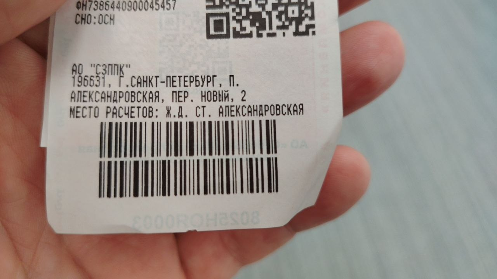

# Билет №1 — Александровская → Балтийский вокзал

## 📷 Изображение



---

## 📋 Отсканированные штрихкоды

| # | Тип | Значение | Длина |
|---|-----|----------|-------|
| A | CODE-128 | `228529450103241233` | 18 цифр |
| B | CODE-128 | `000074735888181911` | 18 цифр |

### Баркод A — детально

```
22 85 29 45 01 03 24 12 33
││ ││ ││ ││ ││ ││ ││ ││ ││
││ ││ ││ ││ ││ ││ ││ │└┴┴33 — постфикс
││ ││ ││ ││ ││ ││ │└─────12
││ ││ ││ ││ ││ │└──────24
││ ││ ││ ││ │└───────03
││ ││ ││ │└────────01
││ ││ │└─────────45
││ │└──────────29
││ └───────────85
│└────────────22 — префикс (22)
```

### Баркод B — детально

```
00 00 74 73 58 88 18 19 11
││ ││ ││ ││ ││ ││ ││ ││ ││
││ ││ ││ ││ ││ ││ ││ │└┴┴11 — постфикс
││ ││ ││ ││ ││ ││ │└─────19
││ ││ ││ ││ ││ │└──────18
││ ││ ││ ││ │└───────88
││ ││ ││ │└────────58
││ ││ │└─────────73
││ │└──────────74
│└───────────00
│└────────────00 — префикс (00)
```

---

## 🧾 Метаданные

| Параметр | Значение |
|----------|----------|
| 📅 Дата скриншота | 10 июля 2026 (файл: 10.07, 09:38) |
| 🚉 Направление | **пос. Александровская → Балтийский вокзал (СПб)** |
| 🎫 Тип билета | Электричка (пригородный поезд) |
| 🔣 Формат | 2 × CODE-128, 18 цифр |
| 📐 Размер изображения | 1280×720 (горизонтальный) |
