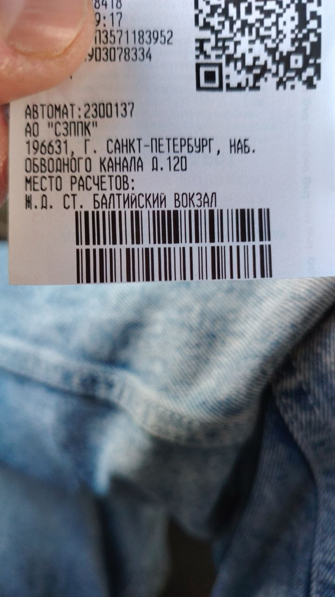

# Билет №2 — Балтийский вокзал → Александровская

## 📷 Изображение



---

## 📋 Отсканированные штрихкоды

| # | Тип | Значение | Длина |
|---|-----|----------|-------|
| A | CODE-128 | `223927450134784733` | 18 цифр |
| B | CODE-128 | `001544685386228511` | 18 цифр |

### Баркод A — детально

```
22 39 27 45 01 34 78 47 33
││ ││ ││ ││ ││ ││ ││ ││ ││
││ ││ ││ ││ ││ ││ ││ │└┴┴33 — постфикс
││ ││ ││ ││ ││ ││ │└─────47
││ ││ ││ ││ ││ │└──────78
││ ││ ││ ││ │└───────34
││ ││ ││ │└────────01
││ ││ │└─────────45
││ │└──────────27
││ └───────────39
│└────────────22 — префикс (22)
```

### Баркод B — детально

```
00 15 44 68 53 86 22 85 11
││ ││ ││ ││ ││ ││ ││ ││ ││
││ ││ ││ ││ ││ ││ ││ │└┴┴11 — постфикс
││ ││ ││ ││ ││ ││ │└─────85
││ ││ ││ ││ ││ │└──────22
││ ││ ││ ││ │└───────86
││ ││ ││ │└────────53
││ ││ │└─────────68
││ │└──────────44
│└───────────15
│└────────────00 — префикс (00)
```

---

## 🧾 Метаданные

| Параметр | Значение |
|----------|----------|
| 📅 Дата скриншота | 13 июля 2026 (файл: 13.07, 19:36) |
| 🚉 Направление | **Балтийский вокзал (СПб) → пос. Александровская** |
| 🎫 Тип билета | Электричка (пригородный поезд) |
| 🔣 Формат | 2 × CODE-128, 18 цифр |
| 📐 Размер изображения | 720×1280 (портретный, мобильный) |
